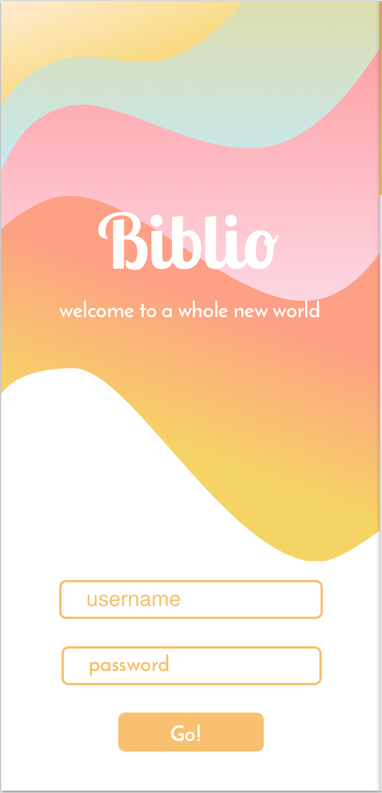

# Biblio

## By Jessica Schmitz

# Description
This is a digital bookshelf that helps the user track books they have read and plan to read. Built with the React Library using Redux for state management.

# Specifications
* The program will hold the necessary files and folders for easy cloning
  * Input Example: **Example**
  * Output Example: **Example**

# Setup Requirements
* Clone this repository
* Run npm install to install all dependencies.
* Run npm start to build and start the development environment.
* Navigate to https://localhost:8080/ to view the project on your local server.

# Technologies
* React
* Redux
* JSX
* CSS
* JavaScript
* Jest/Expect
*

This project uses the _MIT License_
&copy; **Jessica Schmitz** 2018
